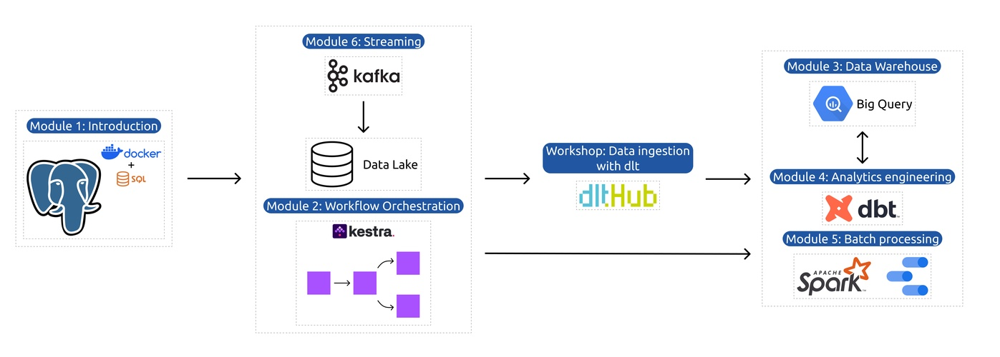

## How the Course will be structured

## 📚 Course Modules

---

### 🧱 Module 1: Containerization and Infrastructure as Code
- 🌐 Introduction to GCP
- 🐳 Docker and Docker Compose
- 🗄️ Running PostgreSQL with Docker
- 🏗️ Infrastructure setup with Terraform
- 📝 Homework

---

### 🔄 Module 2: Workflow Orchestration
- 💧 Data Lakes and Workflow Orchestration
- ⚙️ Workflow orchestration with Kestra
- 📝 Homework

---

### 🛠️ Workshop 1: Data Ingestion
- 🔌 API reading and pipeline scalability
- 🧹 Data normalization and incremental loading
- 📝 Homework

---

### 🏢 Module 3: Data Warehousing
- 🧠 Introduction to BigQuery
- 📊 Partitioning, clustering, and best practices
- 🤖 Machine learning in BigQuery

---

### 🧪 Module 4: Analytics Engineering
- 🛠️ dbt (data build tool) with PostgreSQL & BigQuery
- ✅ Testing, documentation, and deployment
- 📈 Data visualization with Metabase

---

### ⏱️ Module 5: Batch Processing
- 🚀 Introduction to Apache Spark
- 🧮 DataFrames and SQL
- 🔍 Internals of GroupBy and Joins

---

### 🌊 Module 6: Streaming
- 🛰️ Introduction to Kafka
- 🔁 Kafka Streams and KSQL
- 🧬 Schema management with Avro

---

### 🎓 Final Project
- 🧩 Apply all concepts learned in a real-world scenario
- 🤝 Peer review and feedback process
